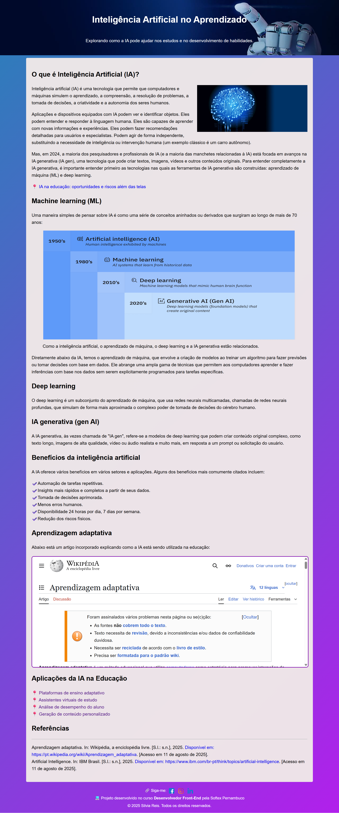

# Site - Inteligência Artificial como Ferramenta de Aprendizado

Este projeto foi desenvolvido como parte de um exercício de programação front-end.

## Objetivo
Criar um site utilizando as tags HTML aprendidas em aula. O tema escolhido foi **Inteligência Artificial (IA) como ferramenta de aprendizado**.

## Visualização do Projeto


- **Repositório no GitHub:** [https://github.com/Silviareis1/I-A-como-Ferramenta-de-Aprendizado](https://github.com/Silviareis1/I-A-como-Ferramenta-de-Aprendizado)  
- **Acesse o site hospedado no GitHub Pages:** [https://silviareis1.github.io/I-A-como-Ferramenta-de-Aprendizado/](https://silviareis1.github.io/I-A-como-Ferramenta-de-Aprendizado/)

## Tags Utilizadas
- `<h1>, <h2>` → títulos
- `<p>` → parágrafos
- `<ul>, <li>` → listas
- `<iframe>` → inclusão de conteúdo externo (artigo da Wikipedia)
- `<header>, <main>, <section>, <footer>` → estrutura semântica
- `<link>` → ligação com arquivo CSS externo

## Sobre o iframe
O `<iframe>` (Inline Frame) é usado para incorporar outro documento HTML ou conteúdo externo (como vídeos, mapas ou páginas inteiras) dentro da página atual.

**Exemplo no projeto:**
```html
<iframe src="https://pt.wikipedia.org/wiki/Intelig%C3%AAncia_artificial"
        width="100%" height="400"></iframe>
```

## Como visualizar localmente
1. Baixe os arquivos.
2. Abra o `index.html` no navegador.
